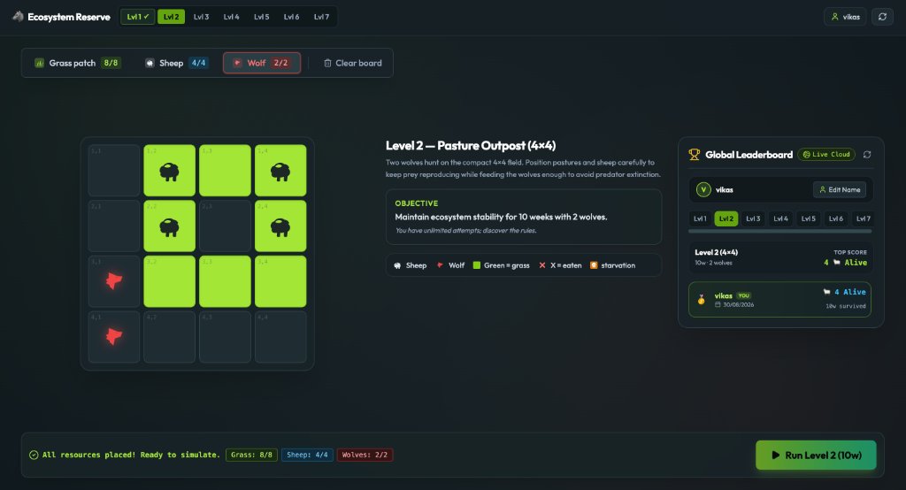
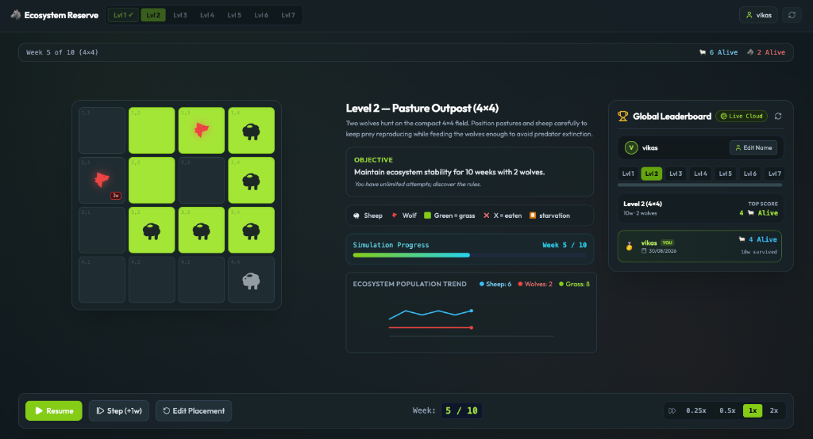

# 🐺 Ecosystem Reserve — Predator vs Prey Simulation Game

An interactive, deterministic cellular automaton puzzle and ecosystem simulation game built with **React**, **TypeScript**, and **Tailwind CSS**. 

🎮 **Play the Live Game Online**: [https://vikaskolanu.github.io/wolf-and-sheep-game/](https://vikaskolanu.github.io/wolf-and-sheep-game/)

---

## 📸 Screenshots & Gameplay

### 1. Strategic Placement Phase
*Distribute your resource budget (grass pastures, sheep, and hunting wolves) before locking in and launching the weekly ecosystem simulation.*



### 2. Live Weekly Ecosystem Simulation
*Watch simultaneous weekly population dynamics unfold with real-time species population trend charts and persistent global leaderboards.*



---

## 🌿 Core Mechanics & Deterministic Rules

1. **Universal 1-Animal-Per-Cell Constraint**:
   - Each tile holds at most **1 animal** (either 1 sheep OR 1 wolf).
   - All available budget resources (grass, sheep, wolves) must be placed before running the simulation.

2. **Wolf Hunting & 4-Week Starvation**:
   - Each alive wolf hunts the closest alive sheep.
   - Wolves move **1 cell per week** towards their target.
   - When reaching a sheep's tile, the prey is consumed immediately and wolf hunger resets.
   - Wolves survive for **4 consecutive weeks without food** before perishing from starvation.

3. **Sheep Grazing & 2-Week Breeding Cycle**:
   - Sheep feed on **grass patches** and stay nourished.
   - While on grasslands, mature sheep reproduce every **2 weeks** into adjacent empty tiles (prioritizing empty grass first, then empty land).
   - If a sheep multiplies directly into a wolf's tile, the wolf eats on the spot and stays in place.
   - Any sheep left on barren land outside grasslands survives for **only 1 week** before starving.

4. **100% Deterministic Engine**:
   - Zero `Math.random()` in simulation execution.
   - Directional priority (`Up -> Right -> Down -> Left`) guarantees identical outcomes regardless of playback speed (`0.25x`, `0.5x`, `1x`, `2x`) or manual single-stepping.

---

## 📈 7-Level Progressive Campaign

| Level | Title | Grid | Target Weeks | Grass | Sheep | Wolves | Player Focus |
|:---:|---|:---:|:---:|:---:|:---:|:---:|---|
| **1** | Solitary Pasture | **4×4** | **8w** | 6 | 3 | 1 | Distance & 2-week breeding basics |
| **2** | Pasture Outpost | **4×4** | **10w** | 8 | 4 | 2 | 2-Wolf perimeter evasion & edge stalling |
| **3** | Two Hunters | **5×5** | **12w** | 10 | 4 | 2 | Stepping up to 5×5 reserve with 2 wolves |
| **4** | Multi-Flock Breeding | **5×5** | **15w** | 12 | 5 | 3 | Multi-flock grazing corridors |
| **5** | Predator Balance | **5×5** | **20w** | 14 | 6 | 4 | High-density multi-pack balance |
| **6** | Master Apex | **5×5** | **30w** | 16 | 8 | 5 | Long-duration 30-week master challenge |
| **7** | Apex Equilibrium | **5×5** | **30w** | 16 | 8 | 6 | Grand Finale with 6 hunting wolves |

---

## 🏆 Global Leaderboard & Machine Learning

- **Global Cloud Leaderboard**: Real-time persistent right-side panel that displays the single highest score for each unique player per level.
- **Machine Learning Data**: Each player's submission data (placement configuration, survival weeks, and outcome) is recorded to train an ML model.

---

## 🚀 Getting Started Locally

### Prerequisites
- Node.js (v18+)
- npm

### Installation
```bash
git clone https://github.com/vikaskolanu/wolf-and-sheep-game.git
cd wolf-and-sheep-game
npm install
```

### Run Local Dev Server
```bash
npm run dev
```
Open [http://localhost:5173](http://localhost:5173) in your browser.

### Build Production Bundle
```bash
npm run build
```

---

## 📄 License
MIT License. Built by [Vikas Kolanu](https://github.com/vikaskolanu).
